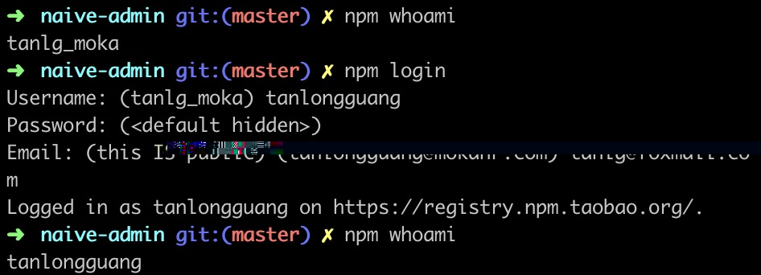

# lerna 的使用方法

[lerna 的文档](https://github.com/lerna/lerna)

使用 lerna 的理由：

    1. 可以让开发者方便的管理 package 之间的依赖。
    2. 大的组织都在用，值得信赖（比如 babel、react）。

## 使用方法

安装全局 cli

```sh
yarn add lerna -g
```

不想安装的话可以使用以下命令初始化项目(不推荐)

```sh
npx lerna init
```

新增项目

```sh
lerna create <package name>
```

新增依赖（一般用于添加项目内的依赖，比如 package B 添加到 package A 中, 如果是项目外的依赖比如 jest 就直接进项目目录 yarn add 就可以了）

```sh
lerna add <软件包> [@version] [--dev] [--exact] [--peer]
```

发布项目：

```sh
lerna publish
```

注意 ⚠️： 发布项目之前需要提前登录 npm 账户，用到的命令可能是以下的：

```
npm whoami
npm login

```



所有子项目安装依赖：

```sh
lerna bootstrap
```

基本上 用到的 80%的命令都是以上这几个....
